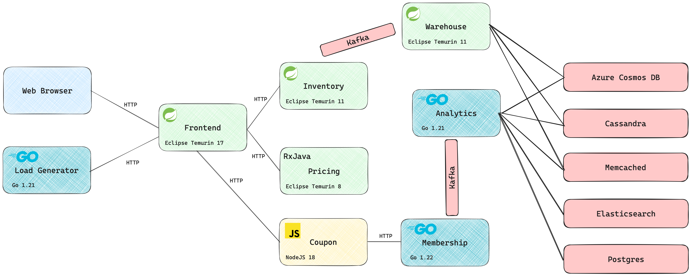

# KV Mall

This is an example of a complex microservice architecture.



## Architecture

KV Mall contains the following services:

| Service | Language   | Version              |
| --- |------------|----------------------|
| Frontend | Java       | 17 (Eclipse Temurin) |
| Inventory | Java       | 11 (Eclipse Temurin) |
| Pricing | Java       | 8 (Eclipse Temurin)  |
| Membership | Go         | 1.21                 |
| Coupon | JavaScript | NodeJS 18.3.0        |
| Analytics | Go         | 1.18                 |
| Warehouse | Java | 11 (Eclipse Temurin) |

## Infrastructure

The following databases and message brokers are used:
- Kafka
- Cassandra
- Memcached
- Elasticsearch
- Azure CosmosDB
- PostgreSQL

## Deploying infrastructure

Before running the kv mall application, you need to deploy the infrastructure. To do so, run the following command:

```bash
make deploy-infra
````

**Make sure all the infrastructure is running before running the application.**

## Running locally

To build the project and run it locally on a Kind cluster, run the following command:

```bash
make build-images load-to-kind deploy
```

